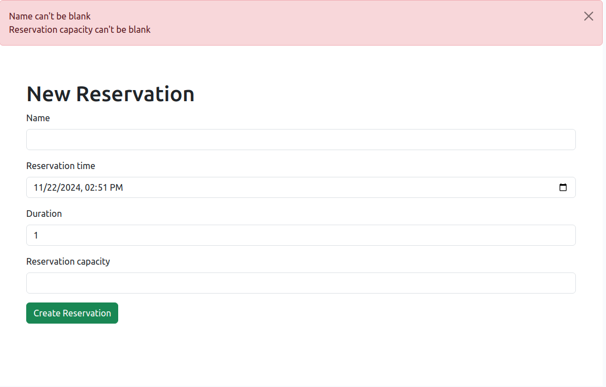

# README

This README would normally document whatever steps are necessary to get the
application up and running.

Things you may want to cover:

* Ruby version

* System dependencies

* Configuration

* Database creation

* Database initialization

* How to run the test suite

* Services (job queues, cache servers, search engines, etc.)

* Deployment instructions

* ...

# Potential problems

1. Need to allocate_tables logic in future
2. Allow reservation for only 1 hour

# How to init project

```ruby
rails db:create
rails db:migrate
rails db:seed
```
# How to start

```
rails s
```

# ENV
1. ruby 3.2.2
2. rails 8.0
3. Postgresql
4. bootstrap
5. rspec

# Results




